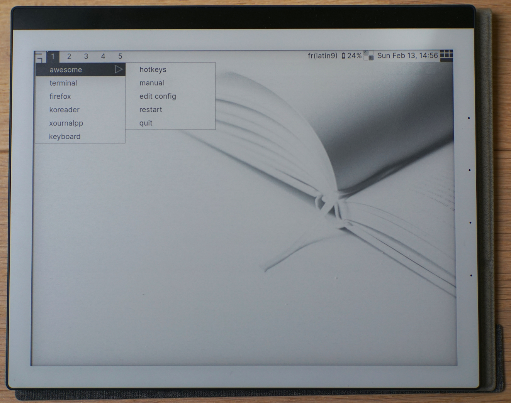
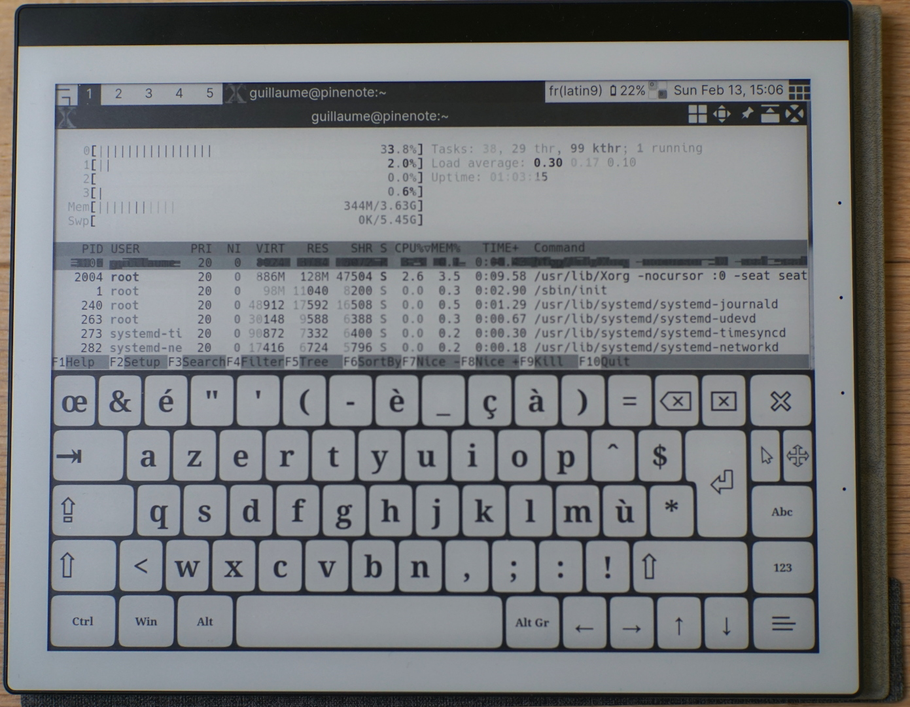

These are my notes and configuration files for running Linux on [PINE64's PineNote](https://www.pine64.org/pinenote/).
My setup uses the following software:

* Distribution: Manjaro ARM.
* Display manager: LightDM.
* Window manager: Awesome.
* On-screen keyboard: Onboard.





Credits
-------

Background image used in theme: [Knowledge enlightenment](https://unsplash.com/photos/J4kK8b9Fgj8)
by Olia Gozha, published under the [Unsplash licence](https://unsplash.com/license).

Base OS and packages
--------------------

Install Archlinux using [Dorian Rudolph's instructions](https://github.com/DorianRudolph/pinenotes).
I am using pgwipeout's kernel and the [Minimal Manjaro rootfs for Quartz64](https://github.com/manjaro-arm/quartz64-bsp-images/releases).

```
pacman  -S awesome lightdm lightdm-gtk-greeter xf86-input-evdev \
           upower light \
           xterm nano xournalpp onboard firefox \
           inter-font hack-font

yay -S ttf-material-icons-git
```

You can install KOReader from the `PKGBUILD` provided in folder `koreader`.

Setup autologin
-------------------------

Add user to `autologin` group:

```
groupadd autologin
gpasswd -a your-user-name autologin
```

Configure LightDM. Edit `/etc/lightdm/lightdm.conf`.

```
[Seat:*]
...
xserver-command=X -nocursor
...
autologin-user=your-user-name
...
```

Run desktop environment
-----------------------

```
systemctl enable --now lightdm
```

Additional settings
-------------------

On-screen keyboard: use high contrast theme.

```
gsettings set org.onboard theme '/usr/share/onboard/themes/HighContrast.theme'
```

Configuration files
-------------------

* `~/.config/awesome/rc.lua`:
    * Use custom theme (`.config/awesome/theme`).
    * Restrict available layouts.
    * Define tag list.
    * Add menu entries for applications and on-screen keyboard (Onboard).
    * Disable titlebar for Onboard and make it non-focusable.
    * Add suspend status indicator.
    * Add button to force a refresh of the e-ink panel.
    * Add battery status.
* `~/.config/awesome/hooks/`: Scripts to turn off/on the frontlight on suspend/resume.
* `~/.Xresources`: Font configuration for Xterm.
* `~/.dmrc`: Set session to AwesomeWM.
* `~/.profile`: Set keyboard layout.
* `/etc/systemd/logind.conf.d/power-button-suspend.conf`: Suspend when the power button is pressed.
* `/etc/udev/rules.d/90-pinenote.rules` (based on the rules file from SXMO): grant write access to `video` group for brightness and refresh controls.
* `/etc/X11/xorg.conf.d/90-pinenote.conf`: Xorg configuration for the touchscreen and stylus (uncomment `TransformationMatrix` if needed).

Hardware control from the command line
--------------------------------------

Battery:

```
cat /sys/class/power_supply/rk817-battery/charge_now
cat /sys/class/power_supply/rk817-battery/charge_full
cat /sys/class/power_supply/rk817-battery/charge_full_design
cat /sys/class/power_supply/rk817-battery/status

# or

upower -i /org/freedesktop/UPower/devices/battery_rk817_battery
```

Frontlight:

```
cat /sys/class/backlight/backlight_cool/max_brightness
echo N > /sys/class/backlight/backlight_cool/brightness

cat /sys/class/backlight/backlight_warm/max_brightness
echo N > /sys/class/backlight/backlight_warm/brightness

# or

light -s sysfs/backlight/backlight_cool -G    # Get
light -s sysfs/backlight/backlight_cool -S N  # Set
light -s sysfs/backlight/backlight_cool -O    # Save
light -s sysfs/backlight/backlight_cool -I    # Restore
```

Suspend:

```
systemctl suspend -i
# Press power button to exit suspend mode
```

E-Ink panel refresh:

```
echo 1 > /sys/module/rockchip_ebc/parameters/force_refresh
```

TODO
----

* Suspend:
  * Suspend when closing the smart cover. Wake up when opening it.
  * Turn frontlight off on suspend, restore on wake-up.
* More info in status bar
  * Wi-Fi
  * Stylus battery
* UI for frontlight control
* Application launcher
